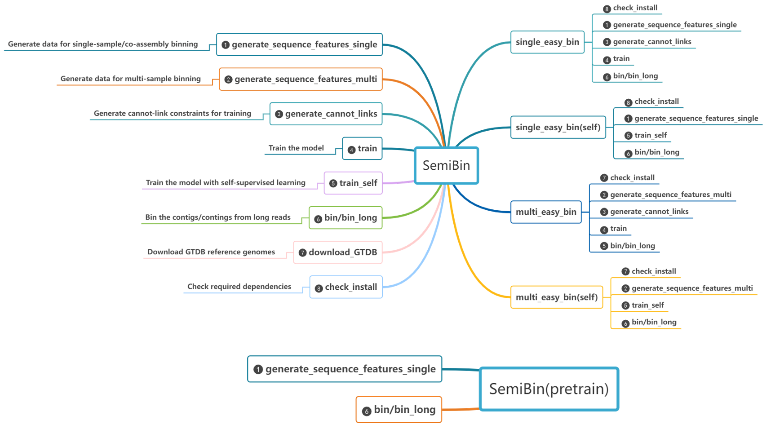

# SemiBin

If you use this software in a publication please cite:

>  Pan, S.; Zhu, C.; Zhao, XM.; Coelho, LP. [A deep siamese neural network improves metagenome-assembled genomes in microbiome datasets across different environments](https://doi.org/10.1038/s41467-022-29843-y). *Nat Commun* **13,** 2326 (2022). [https://doi.org/10.1038/s41467-022-29843-y](https://doi.org/10.1038/s41467-022-29843-y)

The self-supervised approach and the algorithms used for long-read datasets (as well as their benchmarking) are described in

> Pan, S.; Zhao, XM; Coelho, LP. [SemiBin2: self-supervised contrastive learning leads to better MAGs for short- and long-read sequencing](https://doi.org/10.1093/bioinformatics/btad209). *Bioinformatics* Volume 39, Issue Supplement 1, June 2023, Pages i21–i29; [https://doi.org/10.1093/bioinformatics/btad209](https://doi.org/10.1093/bioinformatics/btad209)


SemiBin is a command line tool for metagenomic binning with semi-supervised siamese neural network using additional information from reference genomes and contigs themselves.
It supports single sample, co-assembly, and multi-samples binning modes.

## SemiBin2

When you install the SemiBin package you get both the newer `SemiBin2` command and the older `SemiBin` command.
It is recommended that you use the newer one exclusively for new project and the old one only for backwards compatibility.

## Tutorial

We have a tutorial available with example datasets that runs through most of the
functionality of SemiBin:

https://github.com/BigDataBiology/SemiBin_tutorial


## Install

The simplest way to install is to use [conda](https://conda.io/).

```bash
conda create -n SemiBin
conda activate SemiBin
conda install -c conda-forge -c bioconda semibin
```

See [Install](install) for how to install from source or how to enable GPU usage.

## SemiBin Examples

See the [usage](usage) page for a more in-depth overview of how SemiBin can be used.

## Single-sample binning

[[How to generate inputs to SemiBin](../generate)]

If your assembled contigs are in a file called `S1.fa` (contig file in FASTA format) and you mapped reads and sorted the output to generate the BAM file `S1.sorted.bam`, then you there are two options.


**1. Using a pre-trained model.** This is the fastest option and should work the best if you have metagenomes from one of our prebuilt habitats (alternatively, you can use the `global` "habitat" which combines all of them).

```bash
SemiBin2 single_easy_bin \
        --environment human_gut \
        -i S1.fa \
        -b S1.sorted.bam \
        -o output
```

**2. Learn a new model.** Alternatively, you can learn a new model for your data.
The main disadvantage is that this approach will take longer:

```bash
SemiBin2 single_easy_bin \
        --environment human_gut \
        -i S1.fa \
        -b S1.sorted.bam \
        -o output
```

[](SemiBin.png)

